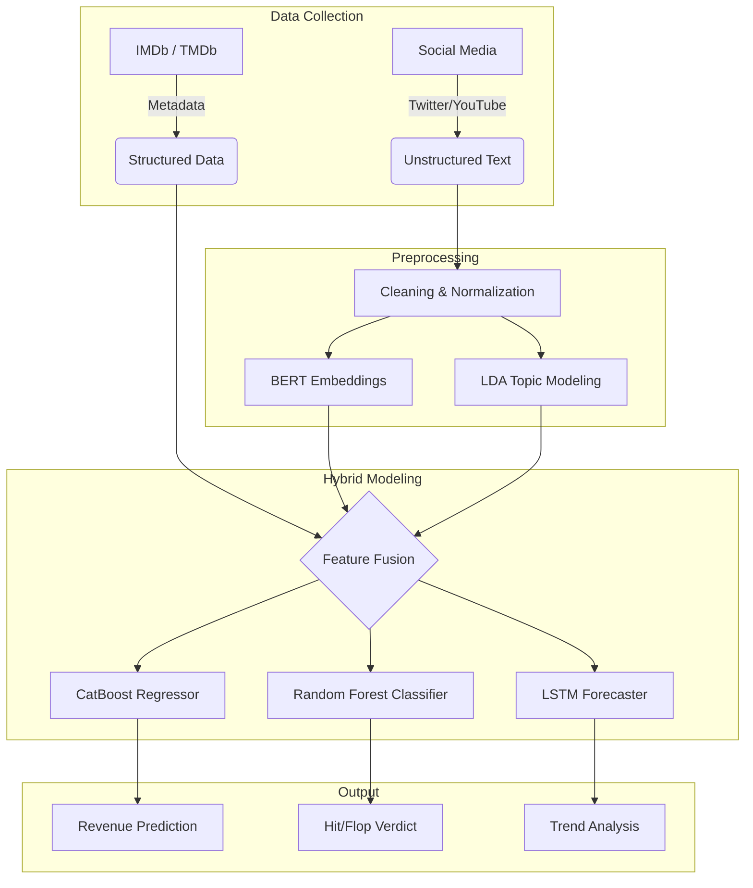

<div align="center">

# 🎬 From Buzz to Blockbuster
### Predicting Movie Revenue via Hybrid Machine Learning & Sentiment Analysis

[](https://ieeexplore.ieee.org/document/10894031)
[](https://www.python.org/)
[](https://pytorch.org/)
[]()

> **"Data-Driven Decisions for the Box Office."**
> A hybrid framework integrating **BERT embeddings**, **CatBoost**, and **LSTM** to forecast financial success with **97.8% Classification Accuracy**.

[View Paper](#-citation) • [Architecture](#-system-architecture) • [Benchmarks](#-performance--benchmarks) • [Installation](#-getting-started)

</div>

---

## 🧐 Abstract

The entertainment industry is volatile. Traditional forecasting relies on static historical data (Cast, Budget, Genre), often missing the "pulse" of the audience. **This project bridges that gap.**

We propose a **Hybrid Predictive System** that fuses quantitative metrics with qualitative real-time data. By leveraging **BERT embeddings** for context-aware sentiment analysis of social media (Twitter, YouTube) and **LSTM** for time-series trend forecasting, we provide actionable insights for studios and investors to mitigate financial risk.

### 🌟 Key Capabilities
* **🧠 Context-Aware Sentiment:** Uses **BERT** and **VADER** to analyze social buzz and **LDA** for topic modeling.
* **📈 Precision Regression:** **CatBoost Regressor** predicts opening weekend revenue with **96% R²**.
* **🏷️ Success Classification:** Categorizes films as *Hit*, *Average*, or *Flop* using **Random Forest**.
* **⏳ Trend Forecasting:** **LSTM** networks analyze temporal engagement patterns.

---

## 🏗️ System Architecture

Our pipeline processes unstructured social data alongside structured movie metadata to feed a multi-model ensemble.


## 📊 Performance & Benchmarks

We rigorously tested our models on a dataset of **10,000 movie records** (80:20 split). The hybrid approach significantly outperforms traditional single-model baselines.

### 2. Revenue Regression Error (Lower is Better)

| Model | MAE (₹ Cr) | RMSE (₹ Cr) | R² Score |
| :--- | :---: | :---: | :---: |
| KNN Regressor | 1.8 | 3.5 | 0.89 |
| Decision Tree | 1.5 | 3.0 | 0.92 |
| **CatBoost (Ours)** | **1.1** | **2.2** | **0.96** |

> **Insight:** CatBoost achieved the highest R² (0.96), explaining 96% of the variance in revenue, making it the superior choice for continuous revenue prediction.

### 3. Time Series Forecasting (LSTM vs ARIMA)

| Model | MAPE (%) | RMSE | Verdict |
| :--- | :---: | :---: | :--- |
| ARIMA | 7.4% | 13.9 | Traditional statistical method struggles with non-linear trends. |
| GRU | 6.9% | 12.6 | Better than ARIMA but slightly less accurate than LSTM. |
| **LSTM** | **5.2%** | **10.1** | **Deep Learning captures complex temporal patterns effectively.** |

---

## 🚀 Getting Started

To get a local copy up and running, follow these simple steps.

### Prerequisites

* **Python 3.9+**
* **Hardware:** 16GB RAM, Intel i7 (Recommended for training)
* **Libraries:** PyTorch, Transformers, CatBoost, NLTK

### Installation

1.  **Clone the repository**
    ```bash
    git clone [https://github.com/VishnuVardhan/Buzz-to-Blockbuster.git](https://github.com/VishnuVardhan/Buzz-to-Blockbuster.git)
    cd Buzz-to-Blockbuster
    ```

2.  **Install dependencies**
    ```bash
    pip install -r requirements.txt
    ```

3.  **Download NLTK Data** (Required for VADER sentiment analysis)
    ```python
    import nltk
    nltk.download('vader_lexicon')
    nltk.download('stopwords')
    ```

### Usage Example

```python
from models import HybridPredictor

# Initialize Model with Pre-trained Weights
predictor = HybridPredictor(weights='./checkpoints/rf_catboost_v1.pth')

# Sample Movie Data
movie_data = {
    "title": "Future Blockbuster",
    "budget_crores": 150,
    "genre": "Sci-Fi",
    "social_sentiment_score": 0.85, # Derived from BERT module
    "trailer_views": 2500000
}

# Run Prediction
prediction = predictor.predict(movie_data)

print(f"Predicted Revenue: ₹{prediction['revenue']} Crores")
print(f"Verdict: {prediction['category']}") # Output: Hit
